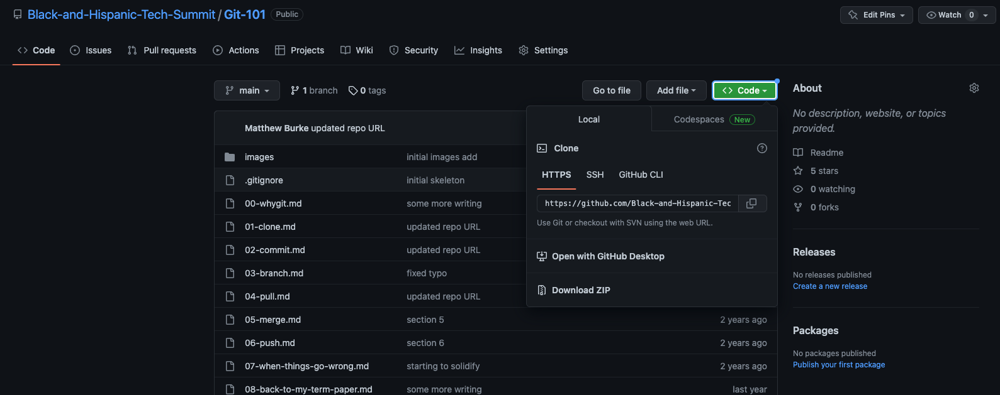
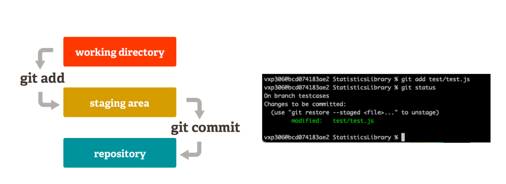
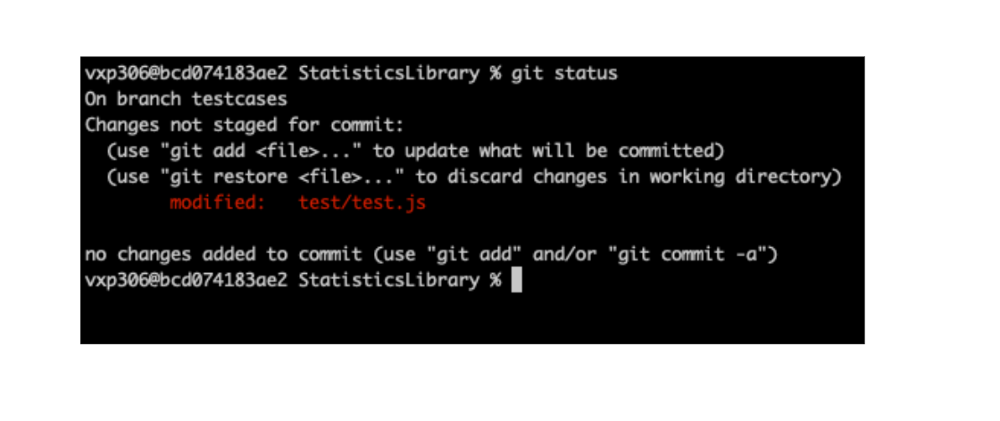
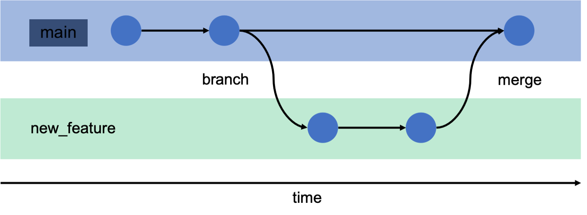
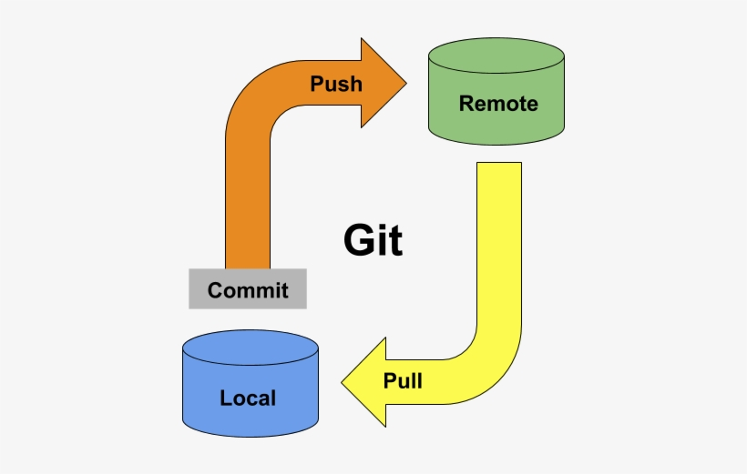
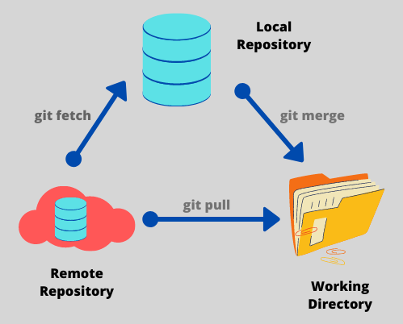

# Git 101

Welcome to Git! By the end of this workshop, you'll be able to:

* Create Git repositories
* Commit changes to Git repositories
* Create branches (parallel copies) of your work
* Use GitHub to create and manage remote repositories
* Synchronize changes between local and remote repositories

## Why Git

Many of us are familiar with some idea of **[version control](https://git-scm.com/book/en/v2/Getting-Started-About-Version-Control)**, which is the process of managing the history of changes to documents, files, and other collections of data. We typically talk about version control in the context of computer programming, but some system of version control has been used for as long as writing has existed!

If you have ever written a paper, a novel, a short story, or a song, you may have held on to different iterations of that work. Perhaps you saved copies that were titled: "version 1", "version 2", "edited", "final", "actual final", "definitely final", *etc.* If so, congratulations, you implemented your own simple system of version control!

A version control system stores a backup of your source code files at each time you specify. And because the version control system we will be using is designed to store these backups very efficiently, you can make backups often. Many developers make these backups (we call them commits) multiple times per hour!

The core features of version control are that you can:

* view past versions
* see who made changes and when
* compare changes between different versions
* revert to an older version

## Git vs GitHub

A common mistake that early engineers make is believing that Git and **[GitHub](https://github.com/)** are the same thing. **Git** is a system for version control. **GitHub**, on the other hand, is a Git repository hosting service.

In overly simplistic terms, Git is a system by which you can manage versions of a project and GitHub is a website where you can backup and share the version histories of those projects.

## Initializing and Cloning Repos

There are two main ways to start a Git repo.

1. `Git init` - Used to create Git repositories locally
1. `Git clone` - Used to create a Git repository based on a repo in GitHub

### Git init

To use `Git init`, navigate in your terminal to a folder which you would like to turn into a Git repository and run:

```zsh
Git init
```

>This should not be done in any top level folder. In other words, your `Documents` or `Desktop` folders should not be initialized to be Git repositories. Instead, create a folder within top level folders to be Git repositories.

While it may not look like much has happened, a hidden `.git` folder was created in that folder which is used behind the scenes to track everything in Git. You will never have to open, read, or edit anything in this folder manually.

In your terminal, you can see these hidden files with the command `ls -a` (stands for list all files). Another way to see hidden files is using your files explorer. Check out how to view this in [Windows](https://support.microsoft.com/en-us/windows/view-hidden-files-and-folders-in-windows-97fbc472-c603-9d90-91d0-1166d1d9f4b5) or [MacOS](https://discussions.apple.com/thread/7581737).

> If you ever accidentally create a Git repository where you do not want one, you can always just remove the `.git` folder. You can do this in any file explorer or in the terminal if you are comfortable with it.

### Git clone


To use `Git clone`, navigate to which ever GitHub repo you would like to clone in your web browser. On the home page of the repo you would like to clone, click the green "Code" button towards the top right, then copy the url provided for the repo.



In your terminal, navigate to the parent folder you would like your repo to go in, then run:

```zsh
# Example - Git clone https://github.com/Black-and-Hispanic-Tech-Summit/Git-101.Git
git clone <githubUrl>
```

## Making Commits

Git doesn't peer over your shoulder and remember every keypress. Instead, at some point you will inform Git that you have changed one or more files in the repository and you want it to record those changes. You do this using the `commit` command.

This is actually a two-step process with Git. First, you use the `add` command to *stage* change(s). Then you *commit* the changes and Git records them.

```zsh
git add some-file
git commit -m "this string is a commit comment"
```



With the above two commands, you have added and committed a new file to my repo. You follow the same process when I make changes to an existing file.

### Staging Many Files

Often times when developing, you will be editing a lot of different files. Rather than having to run many `git add` commands, and listing out many different file names, it is common to just select everything in the current directory. In terminal, the current directory is represented by a period `.`, or sometimes seen as `./`. This would make the add and commit commands look like:

```zsh
git add .
git commit -m "a descriptive commit message here"
```

## Checking the Status

At any time, the `git status` command can be run to get information about what is happening with your Git repo. Each file will have a specific status:

* **Untracked files**: these are files that are completely unknown to Git because they haven't been added (`git add <newfile>`)
* **Changes that are not staged**: these are files that have been added in the past, but since their last commit, they have been changed, and these changes were not added
* **Changes to be committed** - these are files whose changes have been staged, but you have not yet run `git commit`



## Branching



What is a branch? A branch is like creating a copy of your project at a point in time. Once you have branched, the changes you make do not effect your original working copy unless at some point you *merge* them. If you delete a branch without merging its changes, then it is as if you never did any of the work.

Branches should be utilized to implement new features. This way you can safely add new code to your own branch and test it without having impact on the `main` branch, which represents the code that runs in production. Your feature branch may introduce new bugs or break the app all together, but it is ok since it is your safe space. While working through the new feature, you can still commit changes and keep all your project history in git, but in the separate branch.

Once the feature branch has been tested and is ready for prime time, it can be merged into `main` and deployed.

* Create a branch with `git branch <branchName>`.
* Switch to branches with `git checkout <branchName>`
* Create a new branch and switch to it with one command with `git checkout -b <branchName>`
* See all branches with `git branch`

## Merging Branches

To merge branches, use the command `git merge <branchName>`. This command will look to join any commits from the branch named in the command into the branch you are currently on.


Say we have a branch called `coolFeature` and we want to merge those commits into the `main` branch since they have been tested and approved. We can run the following commands:

```zsh
git checkout main
git merge coolFeature
```

## Integrating with GitHub

### Getting code into GitHub

In order to colloborate and store code in GitHub, we need to `push` it from our computers to GitHub with the `git push` command.



### Getting code from GitHub

To get changes from another developer on your team after they have pushed code to GitHub, we must now `pull` it with the command `git pull`



## Practicing Git

Head over to the [practicing Git activity](practicing-git.md) to give all these commands a shot!
