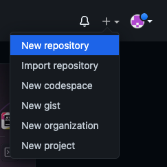
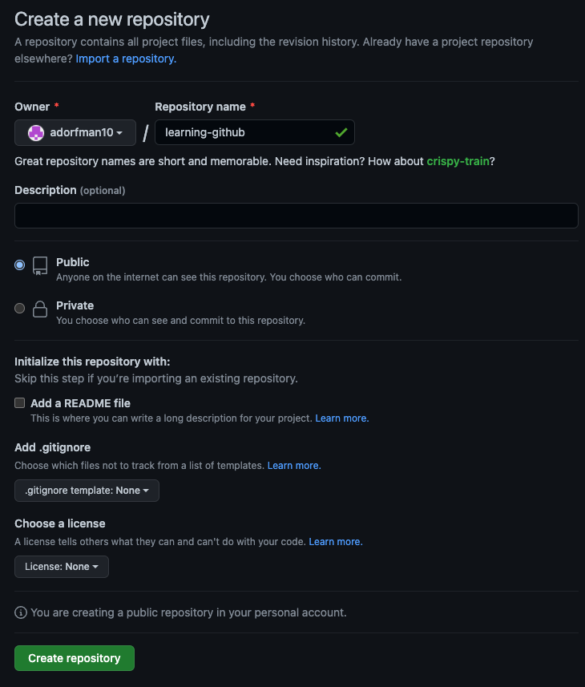
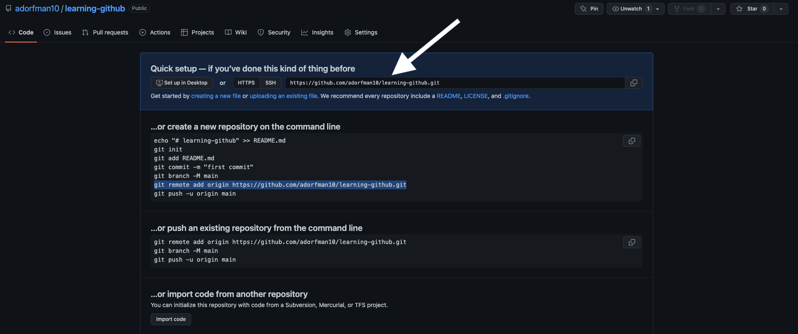
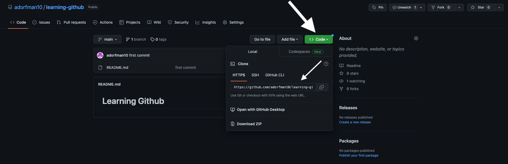

# Git Code-Along

For this part of the day, we're all going to follow the process of creating repositories, committing to them, and reverting changes.

## Create a Repository

1. Open the terminal.
2. Create a new folder by entering: `mkdir git-practice2`
3. Move into that folder by entering: `cd git-practice2`
4. Make this a git repository by entering: `git init`
5. Create a file named `README.md` by entering: `touch README.md`
6. Open the README file in a text editor, and describe the poet William Wordsworth. Kidding! Introduce this repository as a collection of poetry by editing the `README.md` file to have a title line.
7. Back in the command line, verify that there are changes ready to be committed by entering: `git status`
8. Stage your changes by entering: `git add README.md`
9. Run `git status` to verify that `README.md` has been added to the staging area.
10. Commit these changes by entering `git commit -m "Add initial README file"`
11. Run `git status` to verify that there are no more staged changes.
12. Create another file named `cloud.md`

## Commit Changes

1. Edit `cloud.md` to contain the following text:

```txt
I wandered lonely as a cloud
That floats on high o'er vales and hills,
When all at once I saw a crowd,
A host, of golden daffodils;
Beside the lake, beneath the trees,
Fluttering and dancing in the breeze.
```

14. Stage and commit your changes.
15. Append the following to the end of `cloud.md`:

```txt
Continuous as the stars that shine
And twinkle on the milky way,
They stretched in never-ending lip
Along the margin of a bay:
Ten thousand saw I at a glance,
Tossing their heads in sprightly dance.
```

16. Stage and commit your changes.
17. Fix a typo: change "never-ending lip" to "never-ending line"
18. Stage and commit your changes.

## View Changes

19. Verify that these changes were tracked by git by entering: `git log`
20. Copy the hash for the very first thing you committed (which will be at the bottom of the log) to the clipboard. The hash will be different for every person and every commit, but will look something like 13c988d4f15e06bcdd0b0af290086a3079cdadb0
21. View the differences between the last commit and the first commit by entering: `git diff HEAD <<hash>>` replacing &lt;&lt;hash&gt;&gt; with the hash value.

## Practice Branching and Merging

22. Create and switch to a feature branch by entering `git checkout -b formattingFeature`.
23. In this branch, cut up the blocks of text in `cloud.md` into four blocks of 3 lines:

```txt
I wandered lonely as a cloud
That floats on high o'er vales and hills,
When all at once I saw a crowd,

A host, of golden daffodils;
Beside the lake, beneath the trees,
Fluttering and dancing in the breeze.

Continuous as the stars that shine
And twinkle on the milky way,
They stretched in never-ending line

Along the margin of a bay:
Ten thousand saw I at a glance,
Tossing their heads in sprightly dance.
```

24. Stage and commit these changes by entering `git add cloud.md` followed by `git commit -m "formatting cloud.md"`

25. Move back to the `main` branch and merge your feature branch into the `main` branch by entering `git checkout main` followed by `git merge formattingFeature`.

| Command                     | Explanation                                                                     |
| --------------------------- | ------------------------------------------------------------------------------- |
| `git status`                | See info on tracked, untracked and staged files                                 |
| `git add <fileName/path>`   | Stages a specific file or group of files                                        |
| `git commit -m "message"`   | Commits staged files with a descriptive message                                 |
| `git log`                   | Shows the commit history                                                        |
| `git checkout <branchName>` | Used to switch and create (with `-b`) branches                                  |
| `git merge <branchName>`    | Used to merge commits from the selected branch into the currently active branch |

## Integrating Github

26. Create a Github Repo. Go to [github.com](https://github.com), log in, and create a repo by click the `+` in the top right. Feel free to name your repo anything you would like. I recommend something like `learning-github`. All other default options are fine.





1. Set up this Github Repo as a remote on your local git repository. With your terminal opened to your local git repo, run the following command. Note that your Github Url should be shown in the quick setup section if you have nothing in your github repo. If you do have files in your github repo, this can be found by click the green "Code" button towards the top right of the home page of the repo.





```zsh
# Example - git remote add origin https://github.com/adorfman10/learning-github.git
git remote add origin <GithubUrl>
```

> Note - if you had created your git repo by cloning a Github repository, this remote would have already been set. Since we began this activity by running `git init`, we need to tell git where in Github our remote repository is.

28. Push your code with the following command:

```zsh
git push origin main
```

The command above follows the format `git push <remote> <branch>`. In this case, the name of the remote used was called origin as noted in step 27. `origin` is a very common name for the core remote the repo is connected to.

If you don't want to type the remote and branch everytime, you can associate a local branch with a remote branch by setting its upstream. To do so, when you run the `git push` command, add in `-u` before the remote and branch - making the whole command look like `git push -u origin main`. Now whenever you run `git push` from the `main` branch, it will always push to the `main` branch in the designated remote.

Refresh your Github Repo and make sure your code is present.
